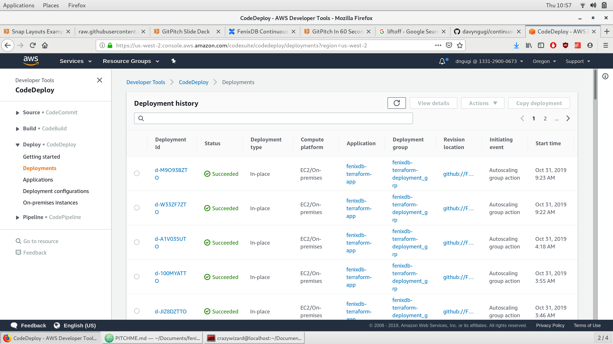
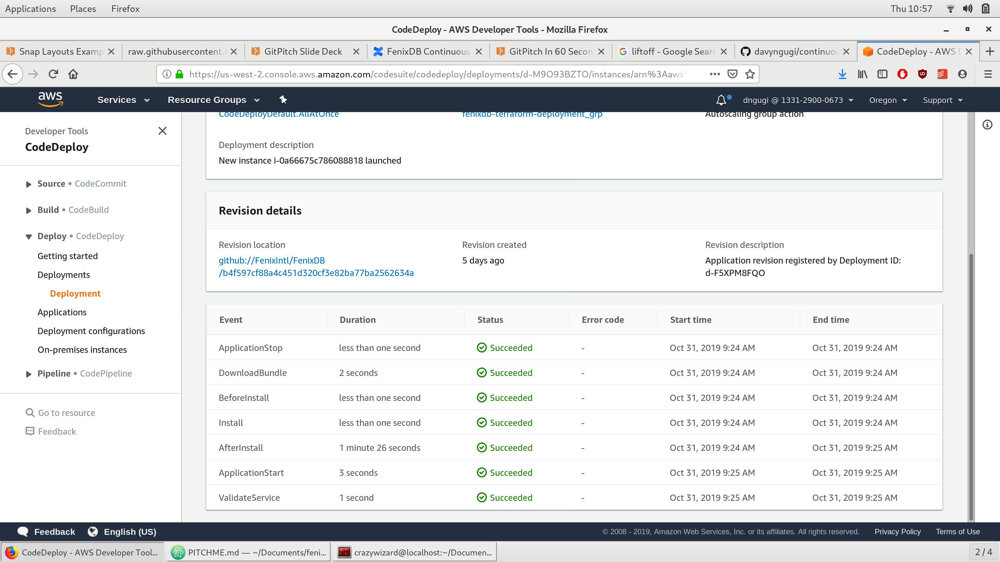

@span[]
## Continuous Delivery with Infrastructure as code
@spanend

@span[south heading]
Part I
@spanend

---
@title[Background]
@snap[north heading]
Background Reading
@snapend
[https://fenixdb.atlassian.net/wiki/spaces/SOF/pages/417824996/FenixDB+Continuous+Deployment+Pipeline+W.I.P](https://fenixdb.atlassian.net/wiki/spaces/SOF/pages/417824996/FenixDB+Continuous+Deployment+Pipeline+W.I.P)

---
@title[Appspec Structure]
@snap[north heading text-pink]
`appspec.yml`
@snapend

```
version: 0.0
os: linux
files:
  - ...
permissions:
  - ...
hooks:
  ApplicationStop:
    - ...
  BeforeInstall:
    - ...
  AfterInstall:
    - ...
  ApplicationStart:
    - ...
  ValidateService:
    - ...
```

---
@title[FenixDB Appspec]
@snap[north-east span-100 text-pink text-06]
`appspec.yml`
@snapend

```yaml zoom-18
version: 0.0
os: linux
files:
  - source: /
    destination: /opt/fenixdb
permissions:
  - object: /opt/fenixdb
    owner: www-data
    group: www-data
    #mode: 777
    type:
      - directory
      - file
  - object: /opt/fenixdb_git_commit
    owner: root
    group: www-data
    type:
      - file
  - object: /opt/fenixdb_queue_name
    owner: root
    group: www-data
    type:
      - file
  - object: /etc/supervisor/conf.d/celery.conf
    owner: root
    group: www-data
    type:
      - file
hooks:
  ApplicationStop:
    - location: scripts/codedeploy/stop_services
      timeout: 300
      runas: root
  BeforeInstall:
    - location: scripts/codedeploy/create_pid_dir
      timeout: 3
      runas: root
    - location: scripts/codedeploy/extract_commit
      timeout: 3
      runas: root
  AfterInstall:
    - location: scripts/codedeploy/setup_git
      runas: root
    - location: scripts/codedeploy/symlink_workers
      runas: root
    - location: scripts/codedeploy/install_dependencies
      runsas: root
    - location: scripts/codedeploy/install_requirements
      runas: root
  ApplicationStart:
    - location: scripts/codedeploy/start_services
      timeout: 30
      runas: root
  ValidateService:
    - location: scripts/codedeploy/status_check
      timeout: 30
      runas: root
```

@snap[south span-100 text-gray text-08]
@[3-5](Specify where to copy files on host)
@[6-13, zoom-13](Define permissions for files and dirs)
@[14,19,24, zoom-12](Stage critical files not part of repo)
@[29-33, zoom-13](Stop all services)
@[34,35,38, zoom-12](Prep the environment)
@[41,42,44,46,48, zoom-12](Setup the application)
@[50,51, zoom-12](Start the application)
@[54,55, zoom-12](Validate all services are running as expected)
@snapend

---
@title[stop services]
@snap[north-east span-100 text-pink text-06]
`scripts/codedeploy/stop_services`
@snapend

```
#!/bin/bash
sudo service uwsgi stop
sudo supervisorctl stop all
```

---
@title[create pid dir]
@snap[north-east span-100 text-pink text-06]
`scripts/codedeploy/create_pid_dir`
@snapend

```
#!/bin/bash
mkdir /var/run/fenixdb
chown -R www-data:www-data /var/run/fenixdb
```

---
@title[extract commit]
@snap[north-east span-100 text-pink text-06]
`scripts/codedeploy/extract_commit`
@snapend

```
#!/bin/bash
archive_path="/opt/codedeploy-agent/deployment-root/$DEPLOYMENT_GROUP_ID/$DEPLOYMENT_ID/bundle.tar"
DIR=$(tar -tzf $archive_path | head -1 | cut -f1 -d"/")
IFS='-'
read -ra ADDR <<< "$DIR"
echo "${ADDR[-1]}" > /tmp/fenixdb_git_commit
```

---
@title[setup git]
@snap[north-east span-100 text-pink text-06]
`scripts/codedeploy/setup_git`
@snapend

```
#!/bin/bash
# Change ownership of top-level directory
sudo chown www-data:www-data /opt/fenixdb

GIT_COMMIT_HASH=$(</tmp/fenixdb_git_commit)

# stage code
cd /opt/fenixdb
git init
git add .
git remote add origin git@github.com:FenixIntl/FenixDB.git
git remote update
git checkout --force $GIT_COMMIT_HASH

# Set permissions in git
sudo chown -R www-data:www-data /opt/fenixdb/.git

# Set the DJANGO_SETTINGS_MODULE for uWSGI
if [[ "$DEPLOYMENT_GROUP_NAME" == "fenixdb_test_deployment_grp_1" ]]
then
  sed -i -e 's/fenixdb.settings.common/fenixdb.settings.development/' /opt/fenixdb/config/fenixdb_uwsgi.ini
elif [[ "$APPLICATION_NAME" == "fenixdb-train-deployment" ]]
then
  sed -i -e 's/fenixdb.settings.common/fenixdb.settings.training/' /opt/fenixdb/config/fenixdb_uwsgi.ini
fi
```

---
@title[sysmlink workers]
@snap[north-east span-100 text-pink text-06]
`scripts/codedeploy/symlink_workers`
@snapend

```
#!/bin/bash
# Symlink to appropriate worker configs
QUEUE_NAME=$(</opt/fenixdb_queue_name)

FENIXDB_WORKERS="/opt/fenixdb/config/supervisor/celery_fenixdb.conf"
MESSAGING_BACKGROUND_WORKERS="/opt/fenixdb/config/supervisor/celery_messaging_background.conf"
FENIXDB_BACKGROUND_WORKERS="/opt/fenixdb/config/supervisor/celery_background.conf"
PAYMENTS_WORKERS="/opt/fenixdb/config/supervisor/celery_payments.conf"
REGULAR_TASKS_WORKERS="/opt/fenixdb/config/supervisor/celery_regular_tasks.conf"
DEFAULT="/opt/fenixdb/config/supervisor/celery_default.conf"

echo "Setting configs for queue $QUEUE_NAME"

if [[ "$QUEUE_NAME" == "fenixdb" ]]
then
  ln -sfn $FENIXDB_WORKERS /etc/supervisor/conf.d/celery.conf
elif [[ "$QUEUE_NAME" == "messaging_background" ]]
then
  ln -sfn $MESSAGING_BACKGROUND_WORKERS /etc/supervisor/conf.d/celery.conf
elif [[ "$QUEUE_NAME" == "background" ]]
then
  ln -sfn $FENIXDB_BACKGROUND_WORKERS /etc/supervisor/conf.d/celery.conf
elif [[ "$QUEUE_NAME" == "payments" ]]
then
  ln -sfn $PAYMENTS_WORKERS /etc/supervisor/conf.d/celery.conf
elif [[ "$QUEUE_NAME" == "regular_tasks" ]]
then
  ln -sfn $REGULAR_TASKS_WORKERS /etc/supervisor/conf.d/celery.conf
else
  sudo ln -sfn $DEFAULT /etc/supervisor/conf.d/celery.conf
fi
```

@snap[south span-100 text-gray text-08]
@[3, zoom-12](Get queue_name for this host)
@[5-10, zoom-13](Different queues for each worker)
@[14-30, zoom-13](Symlink appropriate celery config file)

---?color=linear-gradient(180deg, white 75%, black 25%)
@title[install dependencies]
@snap[north-east span-100 text-pink text-06]
`scripts/codedeploy/install_dependencies`
@snapend

```
#!/bin/bash
sudo apt-get update
sudo apt-get install -y build-essential python-setuptools python-dev \
python-pip libxml2-dev libxslt-dev libssl-dev libevent-dev libaio1 \
psmisc git
```

@snap[south span-100 text-white]
Don't install supervisor with package manager
@snapend

---
@title[install requirements]
@snap[north-east span-100 text-pink text-06]
`scripts/codedeploy/install_requirements`
@snapend

```
#!/bin/bash
cd /opt/fenixdb
rm -rf /opt/fenixdb/env
#sudo pip install --upgrade pip
sudo pip install virtualenv
#sudo pip install setuptools --upgrade --ignore-installed
virtualenv /opt/fenixdb/env
/opt/fenixdb/env/bin/pip install --upgrade pip
/opt/fenixdb/env/bin/pip install setuptools --upgrade
source /opt/fenixdb/env/bin/activate
pip install -r /opt/fenixdb/fenixdb/project_requirements.txt
sudo chown -R www-data:www-data /opt/fenixdb/env
```

---
@title[start services]
@snap[north-east span-100 text-pink text-06]
`scripts/codedeploy/start_services`
@snapend

```
#!/bin/bash
# Only start installed services
if service --status-all 2>&1 | grep -Fq 'uwsgi'; then
  sudo service uwsgi start
elif service --status-all 2>&1 | grep -Fq 'supervisor'; then
  sudo supervisorctl reread
  sudo supervisorctl start all
  sudo supervisorctl update
fi
```

---
@title[status check]
@snap[north-east span-100 text-pink text-06]
`scripts/codedeploy/status_check`
@snapend

```
#!/bin/bash
if service --status-all 2>&1 | grep -Fq 'uwsgi'; then
  status_code=$(curl --write-out %{http_code} --silent --output /dev/null 127.0.0.1/admin)

  if [[ "$status_code" -ne 301 ]] ; then
    echo "Status check FAILED with http_status_code $status_code" 1>&2
    exit 1
  fi
fi


# Check that all workers are running
supervisorctl status > /dev/null
workers_status=$(echo $?)
if [[ "$workers_status" -ne 0 ]] ; then
  echo "Workers failed to start" 1>&2
  exit 3
fi
```

@snap[south span-100 text-gray text-08]
@[2, zoom-12](Only perform status check on installed services)
@[12-18, zoom-13](Use new supervisor feature to get accurate running state)


---
@title[codedeploy configuration]
@snap[north-east span-100 text-pink text-06]
`scripts/codedeploy/aws-deploy.json`
@snapend

```
{
    "applicationName": "fenixdb-terraform-app",
    "deploymentGroupName": "fenixdb-terraform-deployment_grp",
    "revision": {
        "revisionType": "GitHub",
        "gitHubLocation": {
            "repository": "FenixIntl/FenixDB",
            "commitId": "a664c73ec5ce46617f2d27c6ec5570d5df6b7af0"
        }
    },
    "description": "Demo deployment",
    "ignoreApplicationStopFailures": true,
    "autoRollbackConfiguration": {
        "enabled": true,
        "events": [
            "DEPLOYMENT_STOP_ON_REQUEST"
        ]
    },
    "updateOutdatedInstancesOnly": false,
    "fileExistsBehavior": "OVERWRITE"
}
```
@snap[south span-100 text-gray text-08]
@[8, zoom-12](Replace with the latest commit hash)


---?color=linear-gradient(90deg, white 65%, white 65%)
@title[liftoff]
@snap[north text-pink]
## Liftoff!
@snapend


@snap[west span-55]
```
aws deploy create-deployment --cli-input-json \
file://scripts/codedeploy/aws-deploy.json
```
@snapend

@snap[east span-35]
@img[shadow](assets/img/Lift-off.png)
@snapend

---
@title[codedeploy dashboard]


---
@title[Thank You]
@span[north heading]
Source for this presentation
@spanend
[https://gitpitch.com/davyngugi/continuous-delivery#/](https://gitpitch.com/davyngugi/continuous-delivery#/)

---
@title[codedeploy events]

